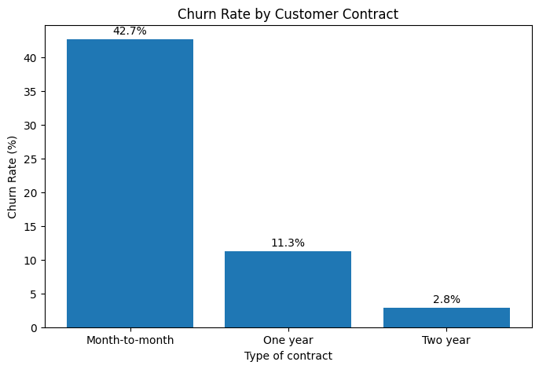
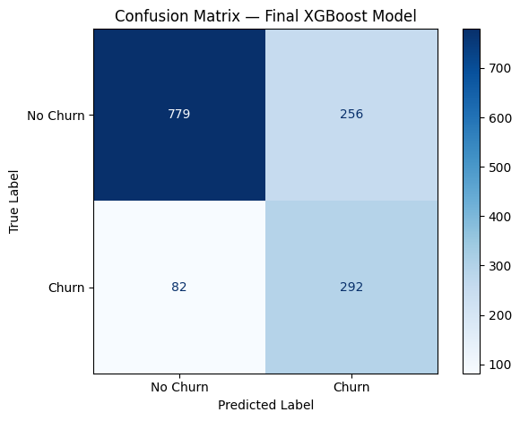
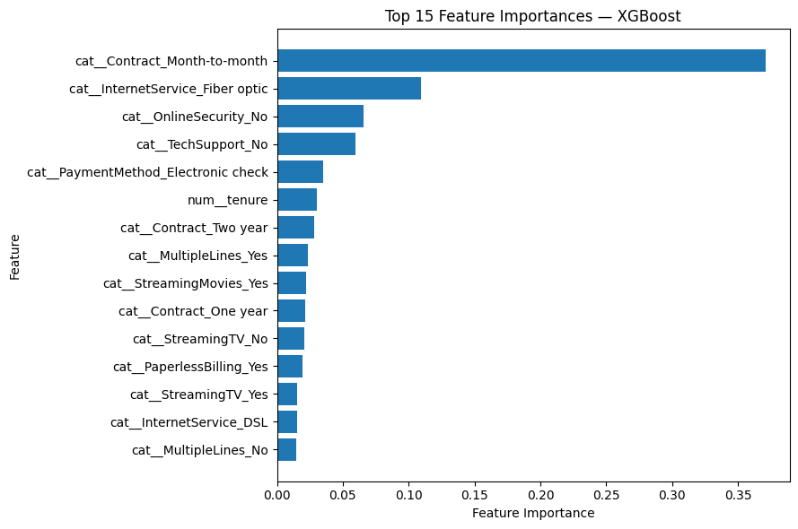

# Customer Churn Prediction

Machine learning project for predicting customer churn in a telecommunications company using customer demographics, subscribed services, contract information, and billing data.

The project covers the complete data science workflow, from exploratory data analysis and preprocessing to model comparison, hyperparameter tuning, threshold optimization, and business-oriented interpretation.

The final solution uses an XGBoost classifier to estimate the probability that a customer will churn, allowing customers to be prioritized for potential retention actions.

## Business Problem

Customer churn represents an important challenge for subscription-based businesses, as losing existing customers can have a significant impact on revenue and customer acquisition costs.

The objective of this project is to develop a predictive model capable of identifying customers with a high risk of churn.

Rather than focusing only on overall classification accuracy, the analysis places particular emphasis on identifying as many potential churners as possible while maintaining a reasonable level of precision. This makes the model suitable for supporting customer retention strategies.

## Dataset

The project uses the IBM Telco Customer Churn dataset, which contains information about telecommunications customers, including:

- Customer demographics
- Contract type and tenure
- Internet and phone services
- Additional services such as online security and technical support
- Billing and payment information
- Monthly and total charges
- Customer churn status

The dataset contains **7,043 customer records and 21 original variables**.

The raw dataset is not included in this repository. Instructions for downloading and placing the dataset are provided in the [Dataset Setup](#dataset-setup) section.

## Project Workflow

The project follows a structured machine learning workflow:

1. **Exploratory Data Analysis**
   - Data quality and missing-value analysis
   - Churn distribution analysis
   - Numerical and categorical feature analysis
   - Identification of customer characteristics associated with churn

2. **Data Preprocessing**
   - Train-test split with stratification
   - Numerical feature standardization
   - One-hot encoding of categorical variables
   - Reproducible preprocessing using `ColumnTransformer` and `Pipeline`
   - Prevention of data leakage

3. **Model Development**
   - Dummy classifier baseline
   - Logistic Regression
   - Random Forest
   - XGBoost
   - Stratified 5-fold cross-validation

4. **Model Optimization**
   - Class imbalance analysis
   - Hyperparameter tuning
   - Model comparison using multiple classification metrics
   - Out-of-fold probability predictions
   - Classification threshold optimization

5. **Model Evaluation & Interpretation**
   - Final evaluation on the held-out test set
   - ROC-AUC and Average Precision
   - Precision, recall, F1 and balanced accuracy
   - Confusion matrix
   - XGBoost feature importance
   - Business-oriented interpretation

## Technologies

- **Python**
- **pandas** and **NumPy** — data manipulation
- **Matplotlib** — data visualization
- **scikit-learn** — preprocessing, pipelines, model evaluation and hyperparameter tuning
- **XGBoost** — gradient boosting classification
- **Joblib** — model serialization
- **Jupyter Notebook** — exploratory analysis and model development

## Key Findings from Exploratory Analysis

The exploratory analysis identified several customer characteristics associated with substantially different churn rates:

- Customers with **month-to-month contracts** showed considerably higher churn than customers with one-year or two-year contracts.
- Customers with **shorter tenure** were considerably more likely to churn.
- Customers using **fiber optic internet** showed higher observed churn rates than DSL customers.
- Customers without **technical support** or **online security** showed higher churn rates.
- **Electronic check** customers presented the highest churn rate among payment methods.
- Customers using **paperless billing** also showed higher observed churn.

One of the strongest patterns was observed for contract type:



Customers with month-to-month contracts showed a churn rate of approximately **42.7%**, compared with **11.3%** for one-year contracts and **2.8%** for two-year contracts.

These findings represent statistical associations within the dataset and should not be interpreted as causal relationships.

## Model Comparison

Several classification models were evaluated using stratified 5-fold cross-validation on the training data.

| Model | ROC-AUC | Average Precision | Balanced Accuracy | Precision | Recall | F1 |
|---|---:|---:|---:|---:|---:|---:|
| Logistic Regression | 0.846 | 0.662 | 0.720 | 0.653 | 0.544 | 0.593 |
| Logistic Regression (Balanced) | 0.846 | 0.660 | 0.766 | 0.518 | 0.803 | 0.629 |
| Random Forest | 0.823 | 0.615 | 0.687 | 0.627 | 0.476 | 0.541 |
| XGBoost | 0.847 | 0.669 | 0.716 | 0.669 | 0.526 | 0.589 |
| Tuned XGBoost | **0.851** | **0.673** | 0.718 | **0.674** | 0.528 | 0.592 |

The tuned XGBoost model achieved the highest mean ROC-AUC and Average Precision, although its performance was relatively close to Logistic Regression.

Balanced Logistic Regression achieved substantially higher recall, illustrating the trade-off between identifying more churners and generating additional false-positive predictions.

XGBoost was selected as the final model based on its probability-ranking performance. The classification threshold was subsequently adjusted to better reflect a customer-retention scenario.

## Final Model Performance

The final tuned XGBoost model was evaluated on the held-out test set using a classification threshold of **0.30**, selected from out-of-fold training predictions.

| Metric | Test Result |
|---|---:|
| Accuracy | 0.760 |
| Balanced Accuracy | 0.767 |
| Precision | 0.533 |
| Recall | **0.781** |
| F1 Score | 0.633 |
| ROC-AUC | 0.848 |
| Average Precision | 0.666 |

At this threshold, the model correctly identified **292 of the 374 customers who churned**, corresponding to approximately **78% recall**.



The lower threshold intentionally prioritizes churn detection over precision. In a retention context, this means accepting more false-positive alerts in exchange for identifying a larger proportion of customers who are actually at risk of leaving.

## Model Interpretation

XGBoost feature importance was used to identify the variables that contributed most strongly to the model's predictions.



Contract type, internet service, online security, technical support, payment method, and customer tenure were among the most relevant predictive features.

Feature importance represents **predictive relevance**, not the direction of an effect or a causal relationship. Therefore, these results should not be interpreted as evidence that a particular feature causes customer churn.

## Business Application

The model produces a churn probability for each customer rather than only a binary prediction.

These probabilities could be used to rank customers according to predicted churn risk and support a targeted retention strategy. For example, a company with limited campaign capacity could prioritize the highest-risk customers rather than contacting the entire customer base.

A potential workflow would be:

1. Generate churn probabilities for active customers.
2. Rank customers from highest to lowest predicted risk.
3. Select customers according to campaign capacity and business constraints.
4. Apply appropriate retention actions.
5. Measure campaign outcomes and use new data to monitor and retrain the model.

The classification threshold should ultimately be determined using real information about customer value, churn costs, intervention costs, and campaign effectiveness.

## Limitations

Several limitations should be considered when interpreting the results:

- The analysis is based on a single historical customer dataset, and performance may differ when applied to another company or customer population.
- The model identifies predictive associations but does not establish causal relationships between customer characteristics and churn.
- The selected threshold of 0.30 represents a retention-oriented scenario rather than a universally optimal decision threshold.
- A real deployment would require information about the financial cost of churn, retention campaigns, and false-positive interventions to determine the optimal business strategy.
- Model performance should be monitored over time because customer behavior and churn patterns may change.

## Repository Structure

```text
customer-churn-prediction/
│
├── data/
│   ├── raw/
│   └── processed/
│
├── notebooks/
│   ├── 01_eda.ipynb
│   ├── 02_preprocessing.ipynb
│   └── 03_modeling.ipynb
│
├── models/
│   └── .gitkeep
│
├── reports/
│   └── figures/
│       ├── churn_by_contract.png
│       ├── confusion_matrix.png
│       └── feature_importance.png
│
├── src/
│   └── predict.py
│
├── README.md
├── requirements.txt
└── .gitignore

The repository separates exploratory analysis, preprocessing and model development from trained model artifacts, selected visualizations, and reusable prediction code.

## Installation

Clone the repository and install the required dependencies:

```bash
git clone <repository-url>
cd customer-churn-prediction
pip install -r requirements.txt
```

## Dataset Setup

This project uses the **IBM Telco Customer Churn** sample dataset.

The raw dataset is **not redistributed in this repository**. It can be obtained from the original IBM project:

**Source:** [IBM — Telco Customer Churn](https://github.com/IBM/telco-customer-churn-on-icp4d)

To reproduce this project:

1. Obtain the Telco Customer Churn dataset from the source above.
2. Rename the CSV file to `sales.csv`.
3. Place it inside:
```text
data/raw/sales.csv
```

The notebooks can then be executed in numerical order:

```text
01_eda.ipynb
02_preprocessing.ipynb
03_modeling.ipynb
```

## Model Reproducibility

The trained model artifact is not included in the repository.

Running `03_modeling.ipynb` reproduces the model development workflow, including model comparison, hyperparameter tuning, threshold selection, final evaluation, and model export.

After running the notebook, the trained pipeline is saved locally as:

```text
models/churn_xgboost_model.joblib
```
The saved artifact contains the complete preprocessing and classification pipeline together with the selected classification threshold.

The src/predict.py module can then be used to load this locally generated artifact and produce churn probabilities and predictions for new customer data.


## Future Improvements

Possible extensions of the project include:

- Evaluating classification thresholds using real customer retention and churn costs.
- Incorporating additional customer behavioral and usage data.
- Monitoring model performance and potential data drift over time.
- Developing an interactive application or API for generating churn predictions.
- Exploring additional model explainability techniques.

## Author

Developed as a Data Science portfolio project.

**María Navarro Cruz**  
Graduate in Data Science and Engineering — Universidad de Las Palmas de Gran Canaria